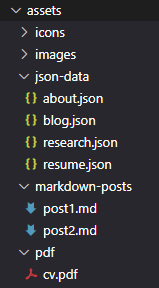

# User guide 

## Updating site content

The only files you have to modify are in the assets folder:



Make sure to work on the **main** branch, when modifying the files on GitHub.
The branch _gh-pages_ is auto-updated.

## About site 

To change any data or text on about page, modify **about.json**.

1. Navigate to _src/assets/json-data_ folder
2. Open _about.json_ file
3. It should look similar to this:
   ```json
   about.json

   {
        "location": "...",
        "phone": "...",
        "email": "...",
        "github": "...",
        "linkedin": "...",
        "scholar": "...",
        "introduction": "...",
        "professionalInterests": "..."
    } 
   ```
4. Modify the content you would like to change
5. Make sure not to modify the structure: i.e. the left side of the colon should stay the same.
6. Save the file

## Résumé site

To modify any data on page Résumé, change **resume.json**.

1. Navigate to _src/assets/json-data_ folder
2. Open _resume.json_ file
3. The basic structure looks like this:
   ```json
   resume.json

   {
      "competitions": [...],
      "education": [...],
      "languages": [...],
      "programmingLanguagesAndTech": [...],
      "software": [...],
      "summerSchools": [...],
      "workingExperience": [...]
   }
   ```
   Attributes are listed in alphabetical order. 

4. Modify the array you wish to change. The data on the website will appear in the same order as it is in the _.json_ file. This means, you probably want to put your new entries to the **top** of the given array. 
    
    ----
- **Competitions** array holds the following attributes:
   ```json
   resume.json -> competitions

   "competitions": [
        {
            "name": "BME Mathematics Competition",
            "year": 2021,
            "result": "First Prize"
        },
        {
            "name": "...",
            "year": 0,
            "result": "..."
        }
      ]
   ```
   There are no restrictions in data format, use the form you would like to see on your site.

   ----
- Array **Education** holds info about your previous schools. Short example entries:
   ```json
   resume.json -> education

   "education": [
        {
            "dateFrom": "2021. 04",
            "dateTo": "2021. 09",
            "name": "Technical University of Munich",
            "result": "",
            "scholarships": [],
            "note": "Erasmus program"
        },
        {
            "dateFrom": "2018. 09",
            "dateTo": "2021. 09",
            "name": "MSc studies in Computer Science, BME",
            "result": "Excellent with highest honours",
            "scholarships": [
                "National scholarship",
                "University scholarship"
            ],
            "note": ""
        }
      ]
   ```
   The following attributes can be empty: _result_, _scholarschips_, _note_. 
   These will be displayed only, if the content not equals " " or [ ].

   - **Attribute descriptions and restrictions**
     - __dateFrom, dateTo__:  No format restrictions.
      _DateTo_ can be left empty.
     - __name__: The name of the educational institution. No format restrictions.
     - __result__: Finishing results. No format restrictions.
     - __scholarships__: Array of strings, no other format restrictions. Can be left empty, but don't forget to add the brackets [ ].
     - __note__: A string in case you would like to add some additional info. No restrictions, can be empty.
    ----
- **Languages** array example: 
    ```json
   resume.json -> languages

   "languages": [
        {
            "name": "English",
            "level": "C1",
            "institution": "Cambridge Certification",
            "year": 2010
        },
        {
            "name": "Norwegian",
            "level": "Native",
            "institution": "",
            "year": 0
        }
      ]
   ```
   - **Attribute descriptions and restrictions**
      - __name__: Name of the language, no format restrictions.
      - __level__: Exam or communication level. No format restrictions, but longer texts (about > 8 char) won't look nice on the current UI.
      - __institution__: Name of the exam institution. No format restrictions, can be blank **(" ")**.
      - __year__: Year of the language exam. Can be set to **0**.
   
   `Spoken languages without exam:` 
   Set _institution_ to **" "** and _year_ to **0**. If there is no given institution, _institution_ and _year_ attributes won't be displayed. 

   ----
- **ProgrammingLanguagesAndTech** array: 
   ```json
   resume.json -> programmingLanguagesAndTech

   "programmingLanguagesAndTech": [
        {
            "name": "C++ (98/11)",
            "level": "advanced"
        },
        {
            "name": "UNIX shell scripting",
            "level": "intermediate"
        },
        {
            "name": "NumPy",
            "level": "advanced"
        }
      ]
   ```
   - **Attribute descriptions and restrictions**
      -  __name__: Name of the programming language or technology, no format restrictions.
      -  __level__: Currently two value is suppoted: _intermediate_ and _advanced_. Any other value won't be displayed!
    ----
- **Software** is a simple string array without any restrictions. Just add the software you are familiar with:
    ```json
   resume.json -> software
   
    "software": [
        "TeXstudio (LaTeX)",
        "PyCharm",
        "..."
    ]
   ```
    ----
- **SummerSchools** array:
    ```json
   resume.json -> summerSchools
   
    "summerSchools": [
        {
            "name": "Name of the Summer School",
            "year": 2000,
            "topics": [
                "Topic 1",
                "Topic 2"
            ],
            "webpage": "https://s3cs.eecs.kth.se/2018/"
        }
    ]
   ```
   - **Attribute descriptions and restrictions**
        - __name__: No restrictions
        - __year__: Format: __YYYY__
        - __topics__: The topics of the summer school. String array, can be left empty. If not empty, _Topics_ title will automatically displayed on the page, before the contents list.
        - __webpage__: Page of the summer school. Creates a link on the school name. Can be empty.
    ---- 
- **WorkingExperience** array: 
    ```json
   resume.json -> workingExperience
   
    "workingExperience": [
        {
            "dateFrom": "2018. 06",
            "dateTo": "2019. 06",
            "title": "Scientific Assistant",
            "institution": "Internship and research at the Hungarian Academy of Sciences, Centre for Economic and Regional Studies",
            "details": [
                "Research on matching under preferences"
            ]
        }
    ]
   ```
   - **Attribute descriptions and restrictions**
        - __dateFrom, dateTo__: No restrictions, _dateTo_ can be left empty.
        - __title__: Name of the position, no format restrictions.
        - __institution__: Name of the workplace. No format restrictions, can be empty.
        - __details__: Description of the position and additional informations. No format restrictions, can be empty.
 

5. After modification save the file.

## Downloadable CV

Your CV can be downloaded by clicking the download button on the header of site Résumé.
To upload a new version of your downloadable CV, take the following steps: 

1. Navigate to _src/assets/pdf_ folder
2. Make sure, that your new CV is saved as a pdf.
3. Rename your new CV to **`cv.pdf`** (small fonts).
4. Drag and drop it to the folder to overwrite the previous cv.
5. If at the end of these steps there is more than one version of your CV, something went wrong! Make sure your CV has the name and extension **`cv.pdf`**.
6. Now your new CV can be downloaded.

## Research site

To change any data or text on page research, modify **research.json**.

1. Navigate to _src/assets/json-data_ folder
2. Open _research.json_ file
3. The basic structure is the following:
   ```json
   research.json

    {
        "conferences": [...],
        "publications": [...],
        "research": [...],
        "studentConferences": [...]
    }
   ```
   Note, that attributes are stored in alphabetical order. 

4. Modify the array you would like to change   
The data on the website will appear in the same order as it is in the _.json_ file. This means, you probably want to put your new entries to the **top** of the given array. 
----
- **Conferences** array structure is the following: 
    ```json
   research.json -> conferences
   
    "conferences": [
        {
            "date": "2019. 03.",
            "nameShort": "STACS 2019",
            "nameLong": "Symposium on Computer Science",
            "country": "Germany",
            "city": "Berlin",
            "institution": "TU Berlin",
            "paperTitle": "Pairwise preferences...",
            "webpage": "https://stacs2019.akt.tu-berlin.de",
            "paperLink": "",
            "authors": [
                "Ágnes Cseh",
                "Attila Juhos"
            ]
        },
        {
            "date": "",
            "nameShort": "short name",
            "nameLong": "full name",
            "country": "",
            "city": "",
            "institution": "",
            "paperTitle": "paper title",
            "webpage": "",
            "paperLink": "",
            "authors": [ ]
        }
    ]
   ```

   - **Attribute descriptions and restrictions**
        - __date__: Date of the conference. No formal restrictions, but try to be consistent either with *YYYY* or with *YYYY. MM.* format.
        - __nameShort__: Short form or abbreviation of the conference name. Can be empty.
        - __nameLong__: Full name of the conference. Can be empty.
        - __country__: The country where the conference took place / the organizer institution can be found. May be empty.
        - __city__: The city where the conference took place / the organizer institution can be found. May be empty.
        - __institution__: Name of the organizing institution. Can be left empty.
        - __paperTitle__: Title of your paper.
        - __webpage__: Webpage of the conference. Can be empty.
        - __paperLink__: Link to your paper, if there is one.
        - __authors__: String list of authors of the paper, can be empty. No format restrictions, but a long list of authors (~ >8) may not show correctly.
    ----
- **Publications** array looks something like this: 
    ```json
   research.json -> publications
   
    "publications": [
        {
            "date": 2000,
            "title": "Publications title here",
            "journal": "ACM Transactions on Economics and Computation (TEAC)",
            "authors": [
                "Ágnes Cseh",
                "Attila Juhos"
            ],
            "paperLink": "https://dl.acm.org/doi/10.1145/3434427"
        }
    ]
   ```

   - **Attribute descriptions and restrictions**
      - __date__: Publication date, format: **YYYY**
      - __title__: Title of the publication. No format restrictions.
      - __journal__: Journal, in which the publication appeared. No format restrictions.
      - __authors__: List of authors, can be empty.
      - __paperLink__: Link to the publication, if there is one. 
    ----
- **Research** array contains the following entries:  
    ```json
     research.json -> research
     
      "research": [
        {
            "dateFrom": "2019. 06.",
            "dateTo": "2021. 05.",
            "title": "Medical (CT) image reconstructions with distinguished interest in CNN-based regularisation and iterative techniques.",
            "supervisor": "Dániel Hadházi",
            "supervisorsInstitution": "BME, Department of Measurement and Information Systems",
            "supporter": "Ministry of Human Capacities under its New National Excellence Program (one year + half year)."
        }
      ]
     ```

     - **Attribute descriptions and restrictions**
        - __dateFrom, dateTo__: Any format works, currently follows _YYYY. MM._ _dateTo_ can be empty.
        - __title__: Title of the project
        - __supervisor__: Project supervisor, can be empty.
        - __supervisorInstitution__: Institution where the supervisor is employed. Only appears when supervisor isn't empty.
        -  __supporter__: Scholarship. May be empty.
    ----
- Every **StudentConferences** array entry contains a single  _conference_ entity with some other attributes:  
    ```json
     research.json -> studentConferences
     
      "studentConferences": [
        {
            "conference": {
                "date": "2021. 05.",
                "nameShort": "TDK",
                "nameLong": "Scientific Conference for Students",
                "country": "Hungary",
                "city": "Budapest",
                "institution": "Eötvös Loránd University, Faculty of Informatics",
                "paperTitle": "CNN-based iterative regularisation for CT image reconstructions.",
                "webpage": "http://tda.inf.elte.hu/index.php?option=com_tdk&view=results",
                "paperLink": "",
                "authors": []
            },
            "supervisor": "Dániel Hadházi",
            "result": "Second prize"
        }
      ]
     ```

     - **Attribute descriptions and restrictions**
       - __conference__: See at array _conferences_. Authors aren't displayed.
       - __supervisor__: Project supervisor, can be empty.
       - __result__: Conference results, no format restrictions.

5. Make sure not to modify the structure: i.e. the left side of the colon should stay the same.
6. Save the file

## Add or remove blogposts

Blogposts are a little more tricky but nothing to worry about. It will take two separate steps: 
- creating / removing the _json_ entry to the post
- creating / removing the post itself in _markdown_

### Add a blogpost

1. Navigate to _src/assets/json-data_ folder
2. Open the file _blog.json_
3. It should look like this:
 ```json
     blog.json
     
      {
        "posts": [
            {
                "date": "2021. 12. 13",
                "title": "First post",
                "description": "This is a test post",
                "content": "../../../assets/markdown-posts/post1.md"
            },
            {
                "date": "2022. 01. 10",
                "title": "Second post",
                "description": "Test",
                "content": "../../../assets/markdown-posts/post2.md"
            }
        ]
    }
```
4. To add a new post, insert a new entry to _posts_ array. You may modify the following example:
```json
{
    "date": "9999. 09. 09.",
    "title": "Example post",
    "description": "This post is an example",
    "content": "../../../assets/markdown-posts/example.md"
}
```
- **Attribute descriptions and restrictions**
  - __date__:  Please follow **yyyy MM dd** format. Spaces are not a must but use some kind of separator characters to distinguish the numbers.
  - __title__: The title of the post.
  - __description__: A short description of the post content. It will appear in the post list and at the start of the individual post as well. Can be left blank.
  - __content__: A link to the markdown file containing the post. It has to look _exactly_ like this: `../../../assets/markdown-posts/`**XXXXX**`.md`, where XXXXX marks the place for the post title.
5. Next create the markdown file, which will contain the new post: 
6. For this, navigate to _src/assets/markdown-posts_ folder
7. Create a new markdown file with the _same_ name you added instead of the _XXXXX_ in _blog.json_
8. _You are ready to write!_ In the same folder you will find an **example.md** file, with some basic informations about the markdown syntax.

### Modify a blogpost

If you modify the _.md_ file's name, make sure to change it in the _blog.json_ as well! (And the other way around.)

Otherwise freely modify the contents of the _.md_ and _.json_.

### Remove a blogpost

If you delete a post, remove it from the blog.json as well. 

If you want to withdraw a post, but not delete it entirely: 

Remove the related _.json_ entry but not the post. This way the post won't be displayed, and you can republish it later by just adding the _blog.json_ entry again.

## Finishing steps

1. **Commit** your changes to the _main_ branch.
2. _Don't_ modify the branch _gh-pages_. It's auto-updated.
3. After 10-15 minutes you should see the changes on your website.
