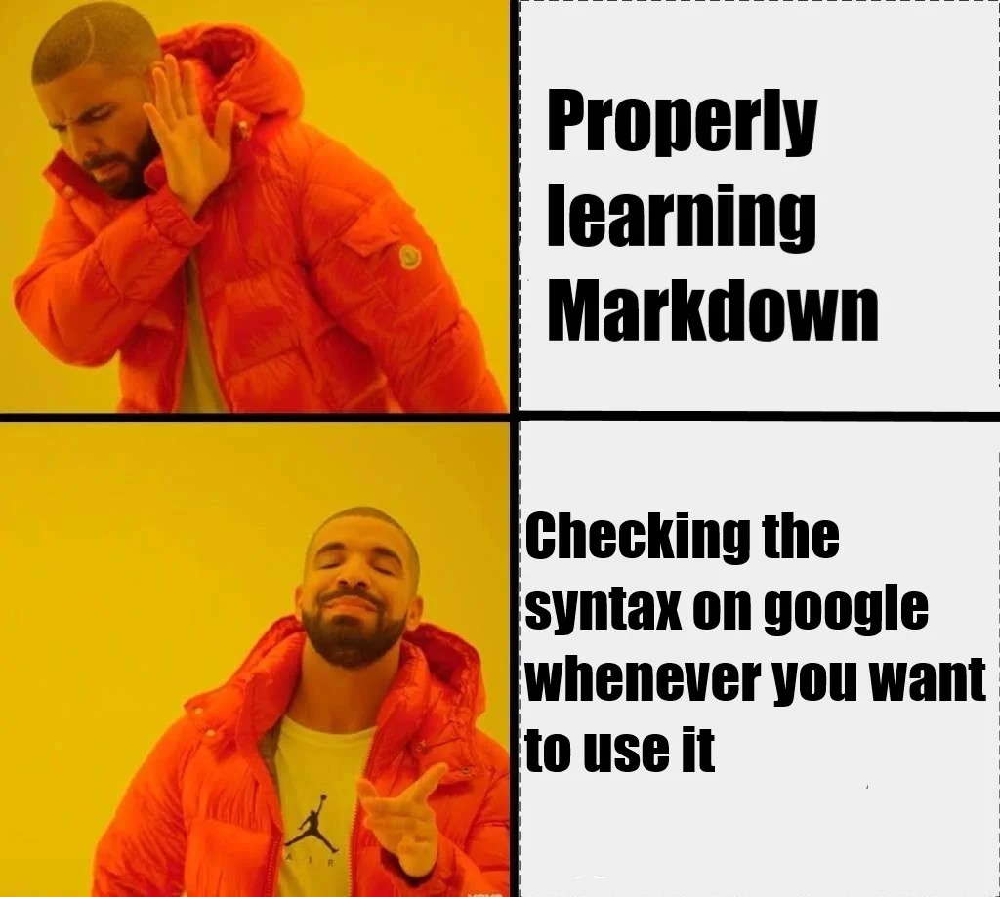

`MD live rendering in VS Code:` **Ctrl+K, V**

_Note, that it's not exactly how it will be displayed your blog, but you will get an idea._

# Markdown
## Titles
### And
#### Headers
##### Don't forget
###### The space!

**bold** or __bold__ 

_italic_ or *italic*

2<sup>nd</sup> : You can always use **HTML**

**Code block**

There will be an automatic copy icon in the top right corner 
Add the language name to the top left corner, to get code coloring. (Currently only python is available.)
                        
```python
# Solve the quadratic equation ax**2 + bx + c = 0

# import complex math module
import cmath

a = 1
b = 5
c = 6

# calculate the discriminant
d = (b**2) - (4*a*c)

# find two solutions
sol1 = (-b-cmath.sqrt(d))/(2*a)
sol2 = (-b+cmath.sqrt(d))/(2*a)

print('The solution are {0} and {1}'.format(sol1,sol2))
```

**KaTeX** should be between **$$**-es:

$$\relax{x} = \int_{-\infty}^\infty
\hat\xi\,e^{2 \pi i \xi x}
\,d\xi$$

$$\nabla \times \vec{\mathbf{B}} -\, \frac1c\, \frac{\partial\vec{\mathbf{E}}}{\partial t}$$

<center>

Let's put this text to the *center*! 

_Don't forget the blank line after the center tags!_

</center>

<center>

|Impressive|:sparkles: Mathemathics :dizzy: |in a marvelous Table!|
|:----------|:------------------------------------------------:|---------:|
|Content on left|..in the middle..|..and on the right.|
| $$\nabla \times \vec{\mathbf{B}} -\, \frac1c\, \frac{\partial\vec{\mathbf{E}}}{\partial t}$$ | :sparkles: $$\frac{4\pi}{c}\vec{\mathbf{j}}    \nabla \cdot \vec{\mathbf{E}}$$ $$\relax{x} = \int_{-\infty}^\infty \hat\xi\,e^{2 \pi i \xi x}\,d\xi$$ :sparkles:| $$\overleftarrow{AB}$$ |

Tables can be a bit tricky to handle. The basic syntax: 
|T|I|T|L|E|
|---|---|---|---|---|
|L|I|N|E||
||L|I|N|E|

</center>


Separator lines contain 3 or more character and a space before them (otherwise they emphasize the previous line).

---
**********
______

Emojis' list:
1. `This text is emphasized with color. :heart:`
2. Please leave a :speech_balloon:!
   - [See the full emoji list here](https://gist.github.com/rxaviers/7360908) :grin:

<center>

Images
---




-----
[``Markdown cheat-sheet``](https://jfcere.github.io/ngx-markdown/cheat-sheet)
----

</center>

**PDF:** no MD support.
Use a link or convert it to image.

Please download the PDF here to view it: <a href="https://ikea.azureedge.net/pdf/70214192.pdf">Download PDF</a>
_or_
download my cv <a href="../../../assets/pdf/cv.pdf">here</a>.


